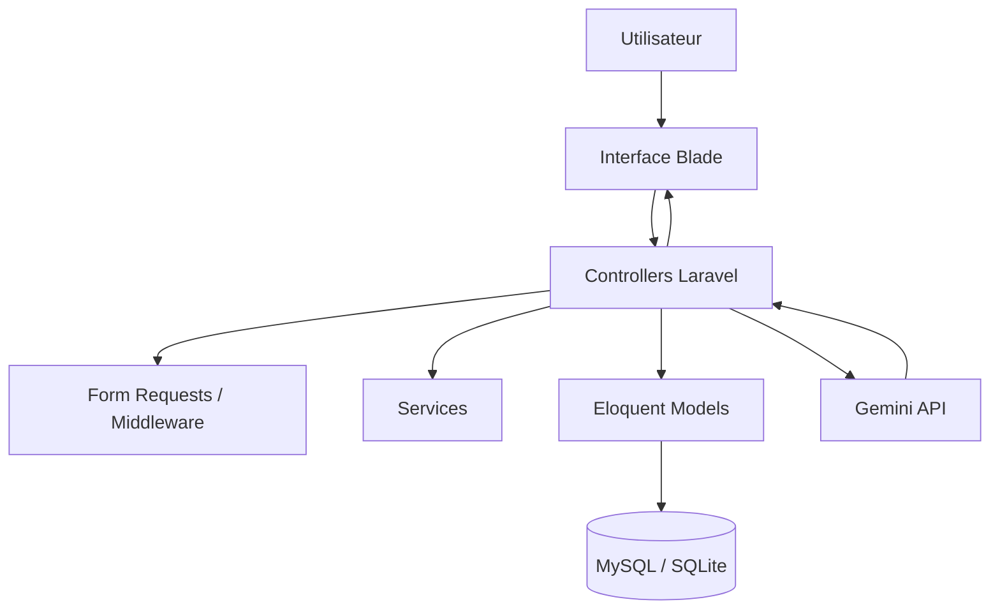

# Architecture de l'Application

## Vue d'ensemble

## Couches principales

- Presentation: Blade, layout guest, layout app, chatbot embarque.
- Application: Controllers, Form Requests, Middleware role.
- Domaine: Models Eloquent, relations utilisateur / CV / offres / candidatures / messages IA.
- Infrastructure: base de donnees, HTTP client Gemini, cache, sessions, queue.

## Flux chatbot

1. L'utilisateur saisit une question.
2. Laravel valide la requete.
3. Les donnees metier pertinentes sont recuperees en base.
4. Un prompt est construit avec contexte, donnees et historique.
5. Le service Gemini envoie la requete HTTP.
6. La reponse est retournee et historisee.
