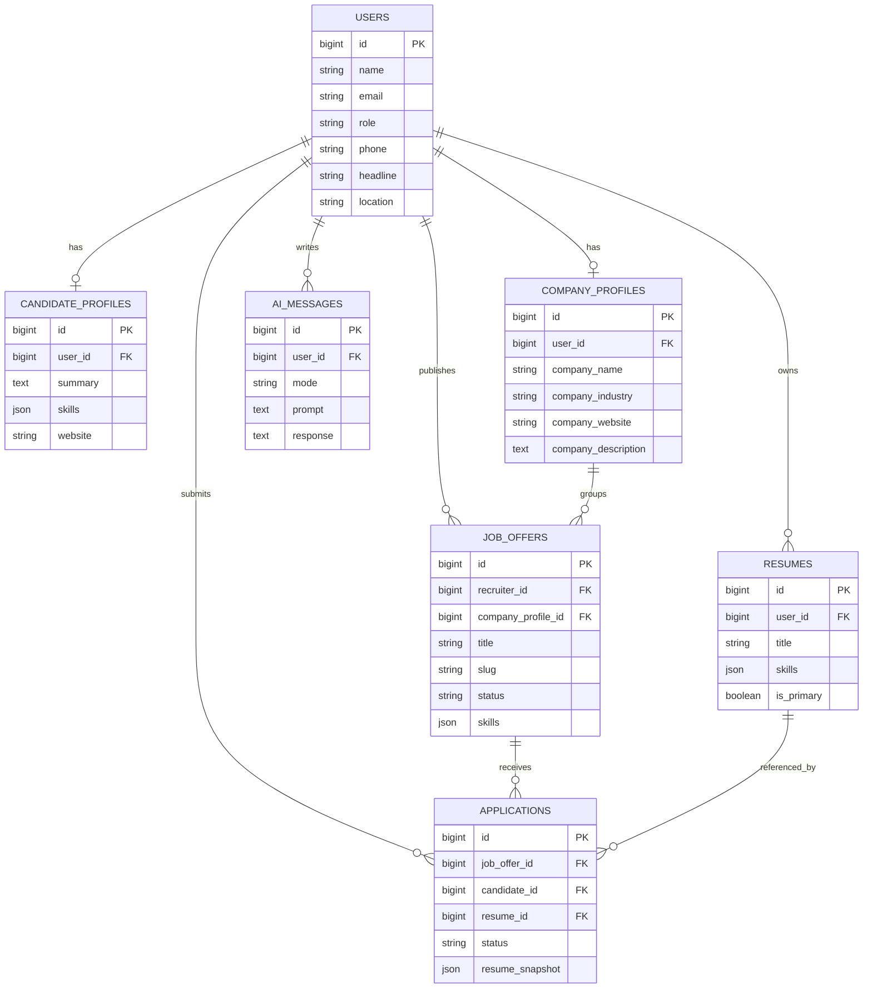

# Modele Entite-Relation

## Relations clefs

- Un utilisateur peut avoir un profil candidat ou recruteur selon son role.
- Un candidat peut creer plusieurs CV, dont un CV principal.
- Un recruteur publie plusieurs offres.
- Une offre recoit plusieurs candidatures.
- Chaque echange IA est conserve pour maintenir le contexte.
